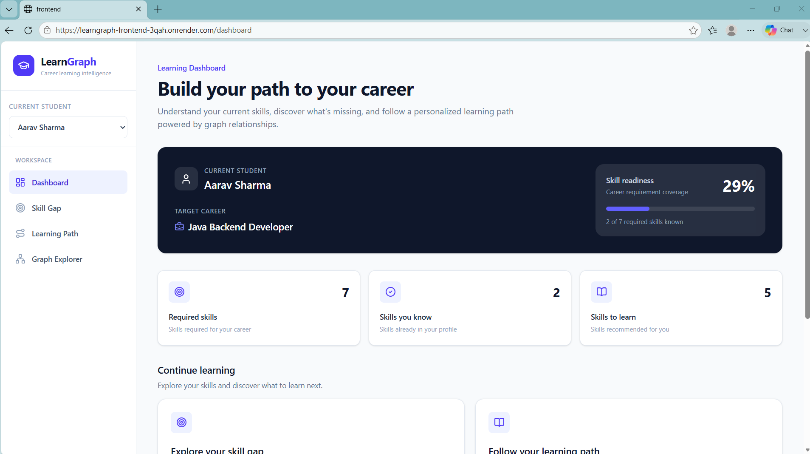
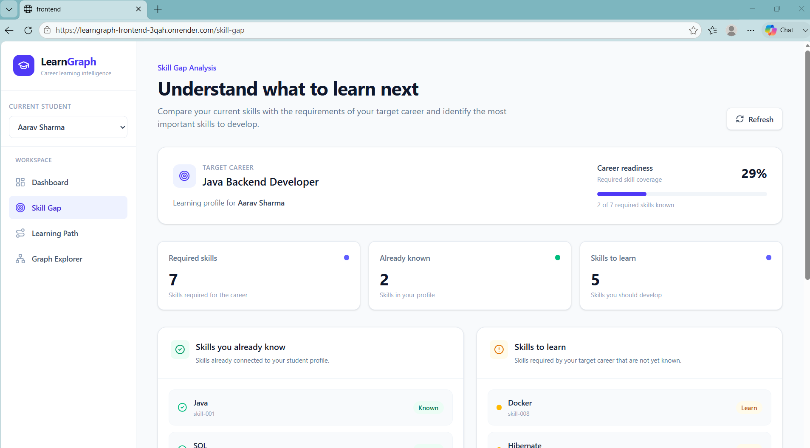

# ✨ LearnGraph ✨

### 🚀 Graph-Based Personalized Learning & Career Path Platform

LearnGraph is a full-stack graph-powered learning platform that helps students understand their current skills, identify missing skills for a target career, discover prerequisite learning paths, and explore their knowledge graph.

The application models relationships between **Students, Skills, Careers, Courses, Topics, and Technologies** using **CognoDB**, a Neo4j-compatible graph database. A Spring Boot backend performs parameterized Cypher queries and exposes REST APIs, while a React frontend provides an interactive dashboard for exploring the generated learning insights.

---

## 🌐 Live Demo

### 🚀 Frontend

https://learngraph-frontend-3qah.onrender.com

### ⚙️ Backend

https://learngraph-backend-yi87.onrender.com

### 🐙 GitHub Repository

https://github.com/Kartavya2005/LearnGraph

---

# 🚀 Project Overview

Traditional learning applications often store students, skills, courses, and careers as independent records.

This makes relationship-heavy questions difficult to answer efficiently.

For example:

> A student knows Java and SQL and wants to become a Java Backend Developer. Which required skills are missing? What prerequisites should they learn first? Which courses teach those skills?

LearnGraph represents these relationships as a graph.

Example:

```text
Student
   │
   ├── KNOWS ───────────────> Skill
   │
   └── TARGETS ─────────────> Career
                                │
                                └── REQUIRES ──> Skill
                                                   │
                                                   └── PREREQUISITE_OF ──> Skill
                                                                               │
                                                                               └── TEACHES ←── Course
```

This graph structure allows LearnGraph to perform multi-hop traversals and generate personalized learning information.

## ✨ Key Features

1.  **Student Dashboard**

    The dashboard provides an overview of the student's current learning status.

    It displays:

    -   Student information
    -   Target career
    -   Total required skills
    -   Skills already known
    -   Skills that need to be learned
    -   Overall skill readiness
    -   Navigation to Skill Gap and Learning Path

2.  **Skill Gap Analysis**

    The Skill Gap feature compares:

    -   Student's Known Skills
            VS
    -   Career's Required Skills

    It identifies:

    -   Skills already known
    -   Missing skills
    -   Required skills for the selected career
    -   Overall readiness percentage

    Example:

    ```
    Known Skills
    ────────────
    Java
    SQL

    Missing Skills
    ──────────────
    Spring Boot
    REST APIs
    Hibernate
    Docker
    Microservices
    ```

3.  **Personalized Learning Path**

    LearnGraph uses prerequisite relationships between skills to create a logical learning sequence.

    Example:

    ```
    Java
      ↓
    Spring Boot
      ↓
    REST APIs
      ↓
    Docker
      ↓
    Microservices
    ```

    Instead of simply listing missing skills, the graph helps determine what should be learned first based on prerequisite relationships.

4.  **Course Recommendations**

    Courses are connected to skills using graph relationships.

    Example:

    ```
    Course
       │
       └── TEACHES ──> Skill
    ```

    The backend can retrieve courses associated with a required skill using parameterized Cypher queries.

5.  **Graph Explorer**

    The Graph Explorer provides a visual representation of the student's graph relationships.

    Example:

    ```
                    Java
                     ↑
                     │ KNOWS
                     │
    Aarav Sharma ────┼──── SQL
                     │
                     │ KNOWS
                     ↓
                    OOP
    ```

    ```
    Aarav Sharma
          │
          │ TARGETS
          ↓
    Java Backend Developer
    ```

    This helps users understand how students, skills, and careers are connected.

6.  **Graph-Based Data Modeling**

    The application models entities such as:

    -   Student
    -   Skill
    -   Career
    -   Course
    -   Topic
    -   Technology

    and relationships such as:

    -   KNOWS
    -   TARGETS
    -   REQUIRES
    -   PREREQUISITE_OF
    -   TEACHES

    This makes relationship-heavy queries natural to express using Cypher.

## 🧠 Why a Graph Database?

The core problem in LearnGraph is relationship-oriented.

A relational database could represent the same information using multiple tables and join tables, but queries involving:

-   career requirements
-   student skills
-   prerequisite chains
-   course relationships
-   multi-hop dependencies

can become increasingly complex.

With a graph database, the relationships are first-class data.

For example:

```cypher
MATCH (student:Student)-[:TARGETS]->(career:Career)
MATCH (career)-[:REQUIRES]->(skill:Skill)
MATCH (student)-[:KNOWS]->(known:Skill)
RETURN student, career, skill, known
```

This allows the application to traverse connected data directly.

## 🗄️ Graph Model

The main graph entities are:

-   `(:Student)`
-   `(:Skill)`
-   `(:Career)`
-   `(:Course)`
-   `(:Topic)`
-   `(:Technology)`

Important relationships include:

-   `(Student)-[:KNOWS]->(Skill)`
-   `(Student)-[:TARGETS]->(Career)`
-   `(Career)-[:REQUIRES]->(Skill)`
-   `(Skill)-[:PREREQUISITE_OF]->(Skill)`
-   `(Course)-[:TEACHES]->(Skill)`

## 👨‍🎓 Example Student

The project contains example seed data for:

**Student**: Aarav Sharma

Known skills include:

-   Java
-   SQL
-   OOP
-   Git

Target career:

-   Java Backend Developer

Example required skills include:

-   Java
-   SQL
-   Spring Boot
-   REST APIs
-   Hibernate
-   Docker
-   Microservices

This allows the application to demonstrate the complete skill-gap and learning-path workflow.

## 🔍 Multi-Hop Graph Traversal

One of the main strengths of LearnGraph is its ability to traverse multiple relationships.

For example:

```
Student
   ↓
TARGETS
   ↓
Career
   ↓
REQUIRES
   ↓
Skill
   ↓
PREREQUISITE_OF
   ↓
Skill
   ↓
TEACHES
   ↑
Course
```

This allows the application to answer questions that require relationships across multiple graph levels.

## 🔐 Parameterized Cypher Queries

The backend uses the Neo4j Java Driver and parameterized Cypher queries.

Example:

```java
session.run(
    query,
    Values.parameters(
        "studentId",
        studentId
    )
);
```

Instead of constructing queries using string concatenation, values are passed as parameters.

This helps keep data values separate from the Cypher query structure and reduces the risk of Cypher injection.

## 🏗️ System Architecture

```
                        ┌──────────────────────────┐
                        │        User Browser      │
                        └────────────┬─────────────┘
                                     │
                                     │ HTTPS
                                     ▼
                        ┌──────────────────────────┐
                        │     React Frontend       │
                        │        Vite              │
                        │      Tailwind CSS        │
                        └────────────┬─────────────┘
                                     │
                                     │ REST API
                                     ▼
                        ┌──────────────────────────┐
                        │    Spring Boot Backend   │
                        │                          │
                        │ Controllers              │
                        │ Services                 │
                        │ Repository               │
                        │ DTOs                     │
                        └────────────┬─────────────┘
                                     │
                                     │ Neo4j Java Driver
                                     ▼
                        ┌──────────────────────────┐
                        │        CognoDB           │
                        │    Graph Database        │
                        │                          │
                        │ Students                 │
                        │ Skills                   │
                        │ Careers                  │
                        │ Courses                  │
                        │ Relationships            │
                        └──────────────────────────┘
```

## 🛠️ Technology Stack

### Frontend

-   React
-   Vite
-   JavaScript
-   Tailwind CSS
-   React Router
-   Axios
-   Lucide React
-   React Flow / graph visualization components

### Backend

-   Java
-   Spring Boot
-   Spring MVC
-   Spring Validation
-   Spring Actuator
-   Maven
-   Neo4j Java Driver

### Database

-   CognoDB
-   Cypher
-   Neo4j-compatible graph model

### DevOps / Deployment

-   Docker
-   Render
-   Git
-   GitHub

## 📁 Project Structure

```
LearnGraph/
│
├── README.md
│
├── backend/
│   │
│   ├── backend/
│   │   │
│   │   ├── pom.xml
│   │   ├── Dockerfile
│   │   ├── .dockerignore
│   │   ├── mvnw
│   │   ├── mvnw.cmd
│   │   │
│   │   └── src/
│   │       │
│   │       ├── main/
│   │       │   │
│   │       │   ├── java/com/learngraph/
│   │       │   │   │
│   │       │   │   ├── config/
│   │       │   │   │   ├── CognoDbConfig.java
│   │       │   │   │   └── CorsConfig.java
│   │       │   │   │
│   │       │   │   ├── controller/
│   │       │   │   │   ├── GraphController.java
│   │       │   │   │   ├── GraphExplorerController.java
│   │       │   │   │   ├── HealthController.java
│   │       │   │   │   ├── LearningPathController.java
│   │       │   │   │   ├── SeedController.java
│   │       │   │   │   └── SkillGapController.java
│   │       │   │   │
│   │       │   │   ├── dto/
│   │       │   │   │   ├── GraphExplorerResponse.java
│   │       │   │   │   ├── LearningPathResponse.java
│   │       │   │   │   └── SkillGapResponse.java
│   │       │   │   │
│   │       │   │   ├── repository/
│   │       │   │   │   └── GraphRepository.java
│   │       │   │   │
│   │       │   │   ├── service/
│   │       │   │   │   ├── SeedService.java
│   │       │   │   │   └── SkillGapService.java
│   │       │   │   │
│   │       │   │   └── BackendApplication.java
│   │       │   │
│   │       │   └── resources/
│   │       │       ├── application.properties
│   │       │       └── db/
│   │       │           └── seed.cypher
│   │       │
│   │       └── test/
│   │
│   └── database/
│       │
│       ├── queries/
│       │   ├── graph-explorer.cypher
│       │   ├── learning-path.cypher
│   │       └── skill-gap.cypher
│       │
│       ├── schema/
│       │   └── constraints.cypher
│       │
│       └── seed/
│           └── seed.cypher
│
└── frontend/
    │
    ├── package.json
    ├── package-lock.json
    ├── vite.config.js
    │
    ├── public/
    │
    └── src/
        │
        ├── api/
        │   ├── axios.js
        │   ├── graphApi.js
        │   ├── learningPathApi.js
        │   ├── skillGapApi.js
        │   └── studentApi.js
        │
        ├── components/
        │   ├── EmptyState.jsx
        │   ├── Layout.jsx
        │   ├── LoadingState.jsx
        │   ├── Sidebar.jsx
        │   ├── SkillBadge.jsx
        │   └── StatCard.jsx
        │
        ├── context/
        │   └── StudentContext.jsx
        │
        ├── pages/
        │   ├── Dashboard.jsx
        │   ├── GraphExplorer.jsx
        │   ├── LearningPath.jsx
        │   └── SkillGap.jsx
        │
        ├── App.jsx
        ├── App.css
        └── index.css
```

## 🔌 API Endpoints

The backend exposes REST APIs for the frontend.

| Method | Endpoint                       | Description             |
| :----- | :----------------------------- | :---------------------- |
| `GET`  | `/health`                      | Backend health check    |
| `GET`  | `/api/skill-gap/{studentId}`   | Get student's skill gap |
| `GET`  | `/api/learning-path/{studentId}` | Get personalized learning path |
| `GET`  | `/api/graph/student/{studentId}` | Get graph data for Graph Explorer |

Example:

`GET /api/skill-gap/student-001`

## 🔎 Example API Response

Example Skill Gap response:

```json
{
  "success": true,
  "data": [
    {
      "skill": "Java",
      "alreadyKnown": true
    },
    {
      "skill": "Spring Boot",
      "alreadyKnown": false
    }
  ]
}
```

## 🧩 Frontend Pages

### Dashboard

**Route**: `/dashboard`

Provides:

-   Skill readiness
-   Required skill count
-   Known skill count
-   Missing skill count
-   Target career
-   Navigation to major features

### Skill Gap

**Route**: `/skill-gap`

Displays:

-   Known skills
-   Missing skills
-   Career requirements
-   Skill gap information

### Learning Path

**Route**: `/learning-path`

Displays:

-   Prerequisite relationships
-   Learning sequence
-   Recommended courses

### Graph Explorer

**Route**: `/graph-explorer`

Displays:

-   Student nodes
-   Skill nodes
-   Career nodes
-   Relationships between graph entities

## ⚙️ Environment Variables

### Backend

The backend uses environment variables for CognoDB credentials.

Required variables:

-   `COGNODB_URI=bolt+s://<instance-id>.databases.cognodb.cloud`
-   `COGNODB_USERNAME=cognodb`
-   `COGNODB_PASSWORD=<your-password>`

The application configuration references them through:

```properties
cognodb.uri=${COGNODB_URI}
cognodb.username=${COGNODB_USERNAME}
cognodb.password=${COGNODB_PASSWORD}
```

**Do not commit actual credentials to GitHub.**

### Frontend

For local development, create:

`frontend/.env`

with:

`VITE_API_URL=http://localhost:8080/api`

For production deployment, configure:

`VITE_API_URL=https://learngraph-backend-yi87.onrender.com/api`

through the hosting platform's environment variables.

## 💻 Local Development

### Prerequisites

Install:

-   Java 25
-   Maven / Maven Wrapper
-   Node.js
-   npm
-   Git
-   Docker (optional)
-   CognoDB account/instance

### 🏃 Running the Backend

Navigate to:

`cd backend/backend`

Configure the CognoDB environment variables.

Then run:

-   **Windows**: `.\mvnw.cmd spring-boot:run`
-   **Linux/macOS**: `./mvnw spring-boot:run`

Backend: `http://localhost:8080`

### 🏃 Running the Frontend

Navigate to:

`cd frontend`

Install dependencies:

`npm install`

Create:

`.env`

with:

`VITE_API_URL=http://localhost:8080/api`

Start the development server:

`npm run dev`

The frontend will normally be available at: `http://localhost:5173`

## 🐳 Docker

The backend includes a Dockerfile for containerized deployment.

Build the backend:

```bash
cd backend/backend
docker build -t learngraph-backend .
```

Run the container:

`docker run -p 8080:8080 learngraph-backend`

The application can then be accessed at: `http://localhost:8080`

## ☁️ Deployment

The project is deployed using Render.

### Backend

The backend is deployed as a Docker-based service.

Production backend: `https://learngraph-backend-yi87.onrender.com`

The backend connects to CognoDB using environment variables configured in Render.

### Frontend

The React/Vite frontend is deployed as a Render Static Site.

Production frontend: `https://learngraph-frontend-3qah.onrender.com`

Build command:

`npm install && npm run build`

Publish directory:

`dist`

Production API variable:

`VITE_API_URL=https://learngraph-backend-yi87.onrender.com/api`

## 🔄 Production Request Flow

```
User
 │
 ▼
React Frontend
 │
 │ Axios REST Request
 ▼
Spring Boot REST API
 │
 │ Neo4j Java Driver
 ▼
CognoDB
 │
 │ Cypher Query
 ▼
Graph Results
 │
 ▼
Spring Boot DTO
 │
 ▼
React UI
```

## 🔒 Security Considerations

LearnGraph follows several basic security practices:

-   CognoDB credentials are stored using environment variables.
-   `.env` files are excluded from Git.
-   Database queries use parameters rather than string concatenation.
-   CORS is configured for local development and the production frontend.
-   Database credentials are not included in the source code.

## 🧪 Error Handling

The frontend provides dedicated states for:

-   **Loading**: Displays loading indicators while API requests are running.
-   **Empty**: Displays an appropriate message when graph data is unavailable.
-   **Error**: Displays user-friendly messages when the backend or graph database cannot be reached.

## 📊 Database Queries

The repository includes dedicated Cypher queries:

```
backend/database/queries/
│
├── graph-explorer.cypher
├── learning-path.cypher
└── skill-gap.cypher
```

Database schema:

```
backend/database/schema/
└── constraints.cypher
```

Seed data:

```
backend/database/seed/
└── seed.cypher
```

The project also contains backend seed resources under:

```
backend/backend/src/main/resources/db/
└── seed.cypher
```

## 🌱 Seed Data

The seed data demonstrates relationships between:

-   Students
-   Careers
-   Skills
-   Courses
-   Technologies
-   Topics
-   Skill prerequisites
-   Career requirements
-   Course-to-skill relationships
-   Student-to-skill relationships

Example:

```
Aarav Sharma
      │
      ├── KNOWS ──> Java
      ├── KNOWS ──> SQL
      ├── KNOWS ──> OOP
      ├── KNOWS ──> Git
      │
      └── TARGETS ──> Java Backend Developer
```

## 🧠 Example Learning Scenario

Suppose:

**Student**: Aarav Sharma

**Known**:

-   Java
-   SQL
-   OOP
-   Git

**Target**:

-   Java Backend Developer

**Career requirements**:

-   Java
-   SQL
-   Spring Boot
-   REST APIs
-   Hibernate
-   Docker
-   Microservices

LearnGraph identifies:

```
Already Known
─────────────
Java
SQL

Skills to Learn
───────────────
Spring Boot
REST APIs
Hibernate
Docker
Microservices
```

The graph can then use prerequisite relationships to determine a learning order.

Example:

```
Java
 ↓
Spring Boot
 ↓
REST APIs
 ↓
Docker
 ↓
Microservices
```

## 🎯 Problem Statement

Students often know some technologies but do not know:

-   Which skills are required for their target career.
-   Which skills they are missing.
-   Which missing skill should be learned first.
-   Which courses are relevant to those skills.
-   How different skills and career requirements are connected.

LearnGraph addresses this by representing the learning ecosystem as a connected graph.

## 💡 Key Technical Highlights

### Graph Database

Used CognoDB to represent highly connected educational and career data.

### Cypher

Used Cypher to perform graph traversal and relationship-based queries.

### Multi-Hop Traversal

Used relationships across multiple graph levels to generate useful learning insights.

### REST API

Built Spring Boot APIs to expose graph data to the frontend.

### React Frontend

Built a responsive frontend for interacting with the generated learning information.

### Docker

Containerized the backend for deployment.

### Cloud Deployment

Deployed the frontend and backend on Render and connected the backend to CognoDB.

## 📈 Future Improvements

Potential future enhancements include:

-   User authentication and authorization
-   Multiple student profiles
-   Dynamic career selection
-   More sophisticated skill recommendation algorithms
-   Course ranking and recommendation scores
-   Learning progress tracking
-   Graph-based recommendation algorithms
-   Personalized course difficulty
-   Resume-based skill extraction
-   AI-assisted career recommendations
-   More graph analytics
-   Automated testing and CI/CD
-   Monitoring and observability
-   Larger real-world datasets

## 🧪 Testing

Before deployment, the backend was built successfully using Maven:

`.\mvnw.cmd clean package -DskipTests`

The application successfully generated:

`backend-0.0.1-SNAPSHOT.jar`

The frontend was also built successfully using:

`npm run build`

Production functionality was tested across:

-   Dashboard
-   Skill Gap
-   Learning Path
-   Graph Explorer
-   Backend API communication
-   CognoDB connectivity
-   CORS configuration
-   React client-side route refreshes

## 📌 Wexa Assignment Requirements

| Requirement                       | Status      |
| :-------------------------------- | :---------- |
| CognoDB used as database layer    | ✅ Complete |
| Graph data model                  | ✅ Complete |
| Labeled nodes                     | ✅ Complete |
| Typed relationships               | ✅ Complete |
| Relationship properties/data      | ✅ Complete |
| Realistic seed data               | ✅ Complete |
| Seed script included              | ✅ Complete |
| Multi-hop traversal               | ✅ Complete |
| Relationship-heavy graph queries  | ✅ Complete |
| Parameterized Cypher              | ✅ Complete |
| Neo4j Java Driver                 | ✅ Complete |
| Spring Boot backend               | ✅ Complete |
| React frontend                    | ✅ Complete |
| Docker deployment                 | ✅ Complete |
| Cloud deployment                  | ✅ Complete |
| Production frontend               | ✅ Complete |
| Production backend                | ✅ Complete |
| CognoDB cloud connection          | ✅ Complete |

## 📷 Application Screens

### Dashboard

The dashboard provides an overview of the student's current career readiness and learning requirements.


### Skill Gap

The Skill Gap page shows the difference between the student's known skills and the skills required for the target career.


### Learning Path

The Learning Path page presents prerequisite-based learning sequences and relevant courses.


### Graph Explorer

The Graph Explorer provides an interactive view of relationships between students, skills, and careers.


## 👨‍💻 Author

**Kartavya Dongre**

*B.Tech Computer Science & Engineering*

GitHub: https://github.com/Kartavya2005

## 📄 License

This project is developed for educational, portfolio, and demonstration purposes.

---

## ⭐ LearnGraph

**Understand your skills. Discover your gaps. Follow your path.**
